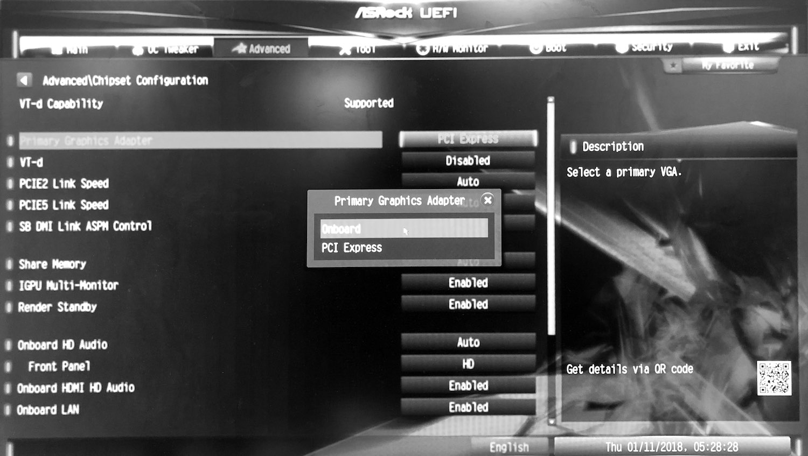
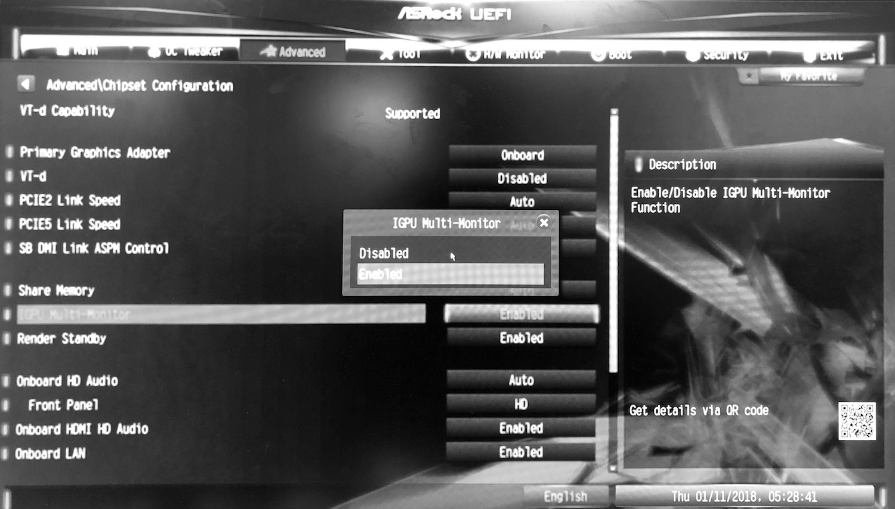

# Build Sugar from Source

Copyright (c) 2016-2018 University of California, Irvine. All rights reserved.

Authors: Zhihao Yao, Zongheng Ma, Yingtong Liu, Ardalan Amiri Sani, Aparna Chandramowlishwaran

This document is shared under the GNU Free Documentation License WITHOUT ANY WARRANTY. See https://www.gnu.org/licenses/ for details.

_____________________________

Sugar leverages modern GPU virtualization solution to provide untrusted web apps with a dedicated virtual graphics plane. This document provides guides to build Sugar on Linux system.

See our [ASPLOS paper](http://www.ics.uci.edu/~ardalan/papers/Yao_ASPLOS18.pdf) for technical details.

Link to our [bug research](webgl_bugs.md).

## Prerequisites

It is strongly recommended to backup your system before proceeding.

### Hardware

Sugar requires an Intel integrated GPU that supports GVT (5th generation or above). Our development is done on Intel Core i7-5775C, 16 GB of memory, 500 GB of SSD, and an ASRock Z97 Extreme4 motherboard. Dual-GPU Sugar requires an additional discrete GPU. We use a Radeon R9 290.

Building Chromium requires,

* A 64-bit Intel machine with at least 8GB of RAM. More than 16GB is highly recommended.
* At least 100GB of free disk space.

**Note: We have only tested Sugar with the above setup.** While it should work for similar setups, in practice it might not. We will provide updates as we test Sugar on other setups.

### Software

Our development is done on Ubuntu 16.04.2 (Mesa 12.0.6). 

You need to have Git, Python, llvm-3.8 installed already. If not, run:

```sh
sudo apt-get install llvm-3.8 python git
```

Sugar Chromium uses Mesa EGL (Chromium uses GLX by default). To build and install EGL and GLES (Mesa 12.0.6) on your system, see [Install Mesa 12.0.6](install_mesa_gles.md).

**Note: This is NOT Sugar Mesa**.

Note: other versions might work, but we recommend to use the same software version.

### Build Systems

To install Mesa and DRM build dependencies, you need to enable the sources for `apt-get`.

```sh
sudo vim /etc/apt/sources.list
# uncomment this line: 
# deb-src http://*.archive.ubuntu.com/ubuntu/ xenial main restricted
# replace * with your country code (e.g. us, gb)
sudo apt-get update
```

Then run:

```sh
sudo apt-get build-dep mesa
sudo apt-get build-dep libdrm
```

To install the driver build dependencies, run:
```sh
sudo apt-get update
sudo apt-get install libx11-dev autoconf python-dev bin86 bcc iasl \
    uuid-dev libncurses5-dev libglib2.0-dev libpixman-1-dev \
    libaio-dev libssl-dev libyajl-dev libc6-dev-i386 libsdl1.2-dev
```

## Get source repositories

```sh
git clone https://github.com/trusslab/sugar_mesa.git
git clone https://github.com/trusslab/sugar_drm.git
git clone https://github.com/trusslab/sugar_igvtg_kernel.git
git clone https://github.com/trusslab/sugar_igvtg_uml_driver.git
```

We will fetch Sugar Chromium code with a customized depot_tools later.


## Setup Igvtg

*This section is based on [iGVT-g_Setup_Guide.txt](https://github.com/intel/Igvtg-kernel/blob/2015q3-3.18.0/iGVT-g_Setup_Guide.txt).*

Add this line to the end of `/etc/initramfs-tools/modules`. Do this **before** building the kernel (just for one time).
```sh
kvm
```

### Install Igvtg kernel driver

Assume you are in the Sugar Igvtg Kernel Driver directory (`sugar_igvtg_kernel/`), run:

```sh
sudo bash build_4.3.0.sh
# hit enter if the script prompts any (yes/no) question
```

### Install Qemu

Run the following script to build and install Qemu. 

```sh
git clone https://github.com/01org/igvtg-qemu -b 2016q3-2.3.0 qemu_src
cd qemu_src/
git submodule update --init dtc
git submodule update --init roms/seabios
./configure --prefix=/usr \
		--enable-kvm \
		--enable-sdl \
		--disable-werror \
		--target-list=x86_64-softmmu
make -j8
cd roms/seabios
git checkout master
LC_ALL=C make -j8
cd -
sudo make install
sudo cp `pwd`/roms/seabios/out/bios.bin /usr/bin/bios.bin
```

### Grub setup

We recommend to add an entry in `/etc/grub.d/40_custom`, though there are many other ways to update grub. Below is an example of grub entry (please make sure you change the UUID and partition number accordingly).

```sh
menuentry 'Ubuntu 16.04.2 LTS (16.04) (on /dev/sda5) - with vgt' --class gnu-linux --class gnu --class os $menuentry_id_option 'osprober-gnulinux-simple-02d8f56d-36e5-4982-9b7f-5f97640713c4' {
        insmod part_gpt
        insmod ext2
        set root='hd0,gpt5'
        if [ x$feature_platform_search_hint = xy ]; then
          search --no-floppy --fs-uuid --set=root --hint-bios=hd0,gpt5 --hint-efi=hd0,gpt5 --hint-baremetal=ahci0,gpt5  02d8f56d-36e5-4982-9b7f-5f97640713c4
        else
          search --no-floppy --fs-uuid --set=root 02d8f56d-36e5-4982-9b7f-5f97640713c4
        fi
        linux   /boot/vmlinuz-4.3.0 root=UUID=02d8f56d-36e5-4982-9b7f-5f97640713c4 ro  quiet splash $vt_handoff intel_iommu=igfx_off i915.hvm_boot_foreground=0 i915.enable_cmd_parser=0 loglvl=all guest_loglvl=all conring_size=4M noreboot i915.enable_vgtbuffer=1
        initrd  /boot/initrd.img-4.3.0
}
```
Once you have added the new grub entry, run: 

```sh
sudo update-grub
```

Note: You need to select the new grub entry every time you boot. You might want to [change the default grub entry](https://wiki.archlinux.org/index.php/GRUB/Tips_and_tricks#Changing_the_default_menu_entry).

### Verify Igvtg is working

Reboot your computer and select the newly added grub entry, run:
```sh
dmesg | grep "vgt"
```

If the VGT is enabled, it should print `vgt_initialize succeeds` and `i915_start_vgt: success`.


## Build user-mode components

**Note: You need to build and install these components in order.**

### Sugar Igvtg uml driver (library)

Assume you are in the Sugar Igvtg uml driver directory (`sugar_igvtg_uml_driver/`), run:

```sh
bash build.sh
sudo bash install.sh
```

### Sugar DRM library

Assume you are in the Sugar DRM directory (`sugar_drm/`), run:

```sh
bash configure.sh
make
sudo make install
```

### Sugar Mesa library

Assume you are in the Sugar Mesa directory (`sugar_mesa/`), run:
```sh
bash configure.sh
make
sudo make install
```


## Build Sugar Chromium

**Note: You should have built and installed all the above programs before continue to build Chromium.**

**Note: Chromium's `install-build-deps.sh` will update Mesa libraries to the newest version, which may cause compatibility issues. A workaround is to build Chromium on a separate system or machine.**

*This section is based on [Google's guide to building Chromium on Linux](https://chromium.googlesource.com/chromium/src/+/lkcr/docs/linux_build_instructions.md)*.

### Install depot_tools

Clone this repository:

```sh
git clone https://github.com/trusslab/sugar_depot_tools.git
```

Assuming you cloned `depot_tools` to `/path/to/depot_tools`, add the following line to the end of `~/.bashrc)`.

```sh
export PATH="$PATH:/path/to/depot_tools"
```

Note: **do not** use `~` on PATH, otherwise the later commands will fail. Rather, you should use either `$HOME` or the absolute path:

```sh
export PATH="$PATH:${HOME}/depot_tools"
```

Note: If you have previously installed the depot_tools from Google, you need to change `export PATH="$PATH:</path/to/Google_depot_tools>"` to `export PATH="$PATH:</path/to/Sugar_depot_tools>"` in your `~/.bashrc` file.

### Fetch Sugar Chromium

Create a `chromium` directory for the checkout and change to it (you can call this whatever you like and put it wherever you like, as long as the full path has no spaces):

```sh
mkdir ~/chromium && cd ~/chromium
```

Run the following command to check out the code and its dependencies:

```sh
fetch --nohooks chromium
```

Note: `fetch` will clone the repository at `https://github.com/trusslab/sugar_chromium`. This command might take a while depending on your Internet connection. Expect a few hours.

Note: If you don't want the full git history, you can save a lot of time by adding the `--no-history` flag to `fetch`.

Notes: Errors in `src/third_party/swiftshader/third_party/pnacl-subzero` and `src/third_party/skia/DEPS` are fine. These remote repositories are no longer available. Sugar Chromium does not depend on them.

The remaining instructions assume you are in the `src` directory:

```sh
cd src
```

### Install build dependencies

You will need to run the following script only once. If you have previously run `install-build-deps.sh` in another repository, you do not need to run it again.

```sh
build/install-build-deps.sh
# type 'yes' if the script asks for installing dev software
```

You need to run the following commands in every new repository. This will clone git submodules and build tools.

```
gclient runhooks
source ./build_setup.sh
```

### Setup the build

To set up a new build, run:

```sh
gn gen out/Default
```

Note: You can replace `Default` with another name, but it should be a subdirectory of `out`.

Then run:

```sh
gn args out/Default
```

The command will automatically open a config file with `vim`. Append the following lines to the file:

```sh
is_debug = false
dcheck_always_on = false
is_component_build = false
```

To build, run:

```sh
ninja -C out/Default chrome
```

Note: to speed up your build, you might want to add `-j` flag to enable multi-thread. For example,

```sh
ninja -j16 -C out/Default chrome
```


## Run Sugar

You need to run the following command **after every reboot**:
```sh
sudo chmod 222 /sys/kernel/vgt/control/create_vgt_instance
sudo chmod 666 /sys/kernel/vgt/control/mmio
```

To launch Sugar Chromium, run:
```sh
<path/to/Chromium/src>/out/Default/chrome --disable-gpu-vsync --no-sandbox --start-maximized
```

You may want to designate a new user data folder to avoid conflicts with another Chrome on your machine. To do so, append `--user-data-dir=<New User Data Location>` to the command line.

Note: you might want to remove the user data folder, or designate a new folder when Sugar Chromium crashes, so that Chromium will not block the crashed web apps.


## Switch to Dual-GPU

### BIOS settings

You need to enable the discrete GPU and the multi-monitor mode through BIOS settings. Below is an example:





Note: some BIOSes might not support the multi-monitor mode.

### Igvtg kernel driver

Assume you are in the Sugar Igvtg Kernel Driver directory (`sugar_igvtg_kernel/`). 

```sh
vim vgt_mgr
# replace all 'card0' with 'card1'
```

Compile and install:

```sh
sudo bash build_4.3.0.sh
# hit enter if the script prmopts any (yes/no) question
```

### Sugar Igvtg uml driver (library)

Assume you are in the Sugar Igvtg uml driver directory (`sugar_igvtg_uml_driver/`).

```sh
vim arch/um/isol_prints.h
# replace '/dev/dri/card0' with '/dev/dri/card1'
vim include/linux/prints.h
# uncomment '#define I915_VGT_ISOL_TWO_GPU'
```

Compile and install:

```sh
bash build.sh
sudo bash install.sh
```

### Sugar Mesa library

Assume you are in the Sugar Mesa directory (`sugar_mesa/`).

```sh
vim include/my_prints.h
# replace '/dev/dri/card0' with '/dev/dri/card1'
```

Compile and install:

```sh
make
sudo make install
```

### Sugar Chromium

Assume you are in the Sugar Chromium directory (`chromium/src/`).

```sh
vim base/prints.h
# replace '/dev/dri/card0' with '/dev/dri/card1'
```

Compile:

```
ninja -C out/Default chrome
```


## Troubleshooting

If web apps crash when accessing memory address at 0xd…, this might be a known bug that vGPU memory location is changed as a result of hardware configurations. We will fix this bug soon. A workaround is:

Assume you are in the Sugar Igvtg uml driver directory (`sugar_igvtg_uml_driver/`).

```sh
vim arch/um/kernel/physmem.c
# replace '0xd0000000' in ioremap() with '0xe0000000'
```

Then, compile and install.