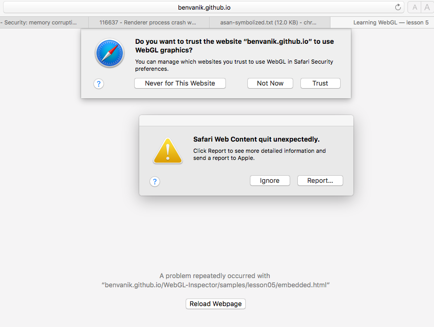
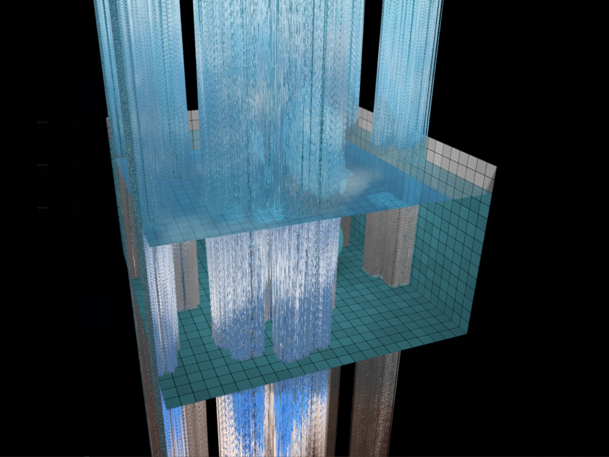
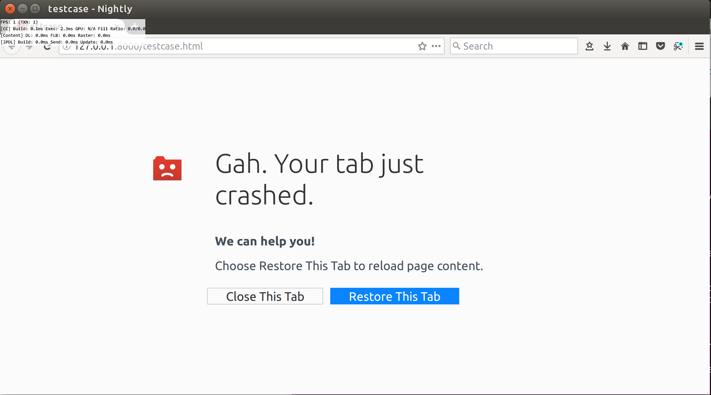
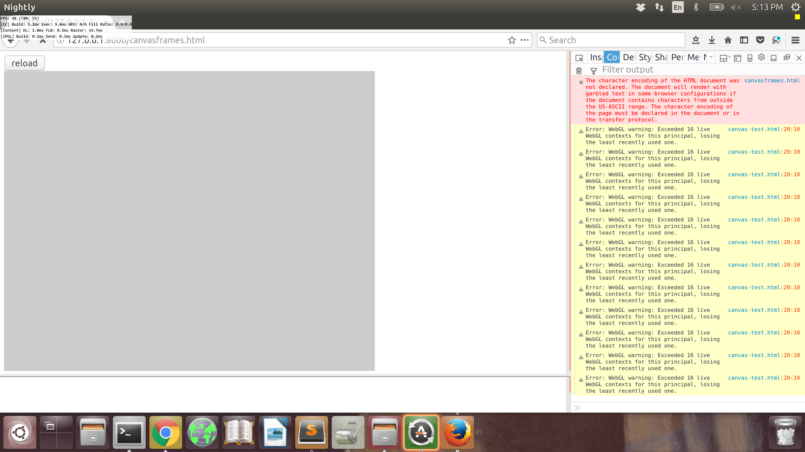
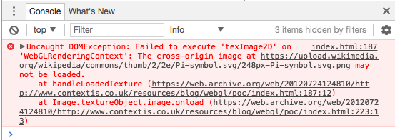
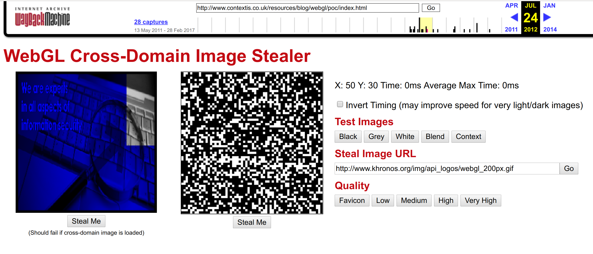
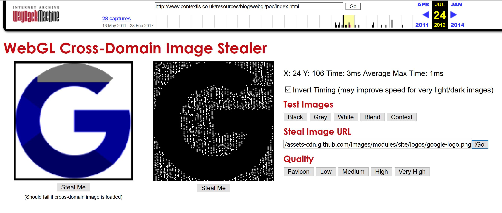
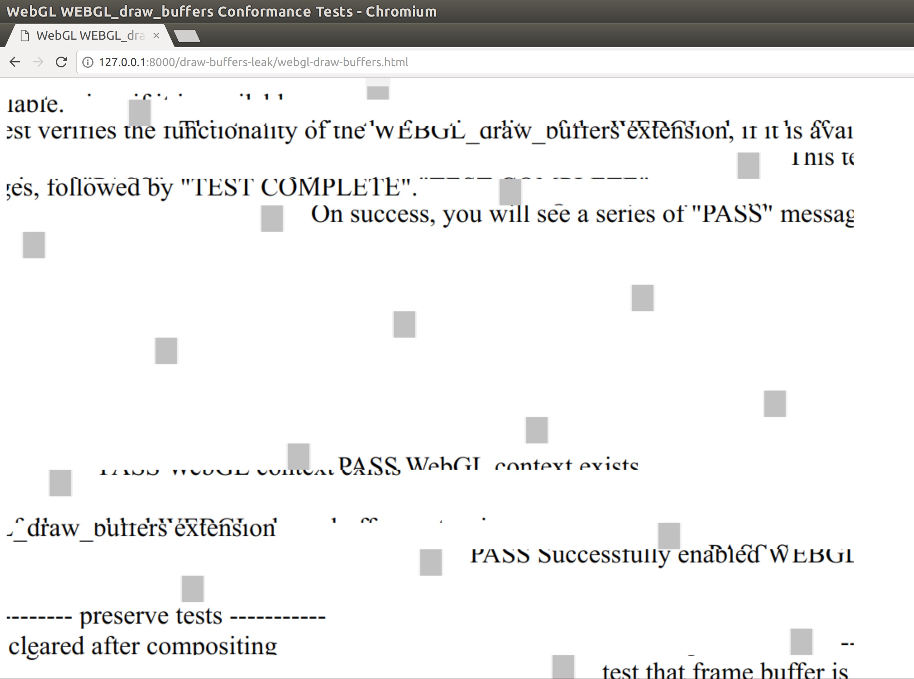

# WebGL Bug Research

Copyright (c) 2016-2018 University of California, Irvine. All rights reserved.

Authors: Zhihao Yao, Zongheng Ma, Yingtong Liu, Ardalan Amiri Sani, Aparna Chandramowlishwaran

This document is shared under the GNU Free Documentation License WITHOUT ANY WARRANTY. See https://www.gnu.org/licenses/ for details.

All reports and source code are publicly available at their respective websites.

Chromium/Chrome bugs are tested on commit# 08b987e148376845467f8e1ff3abcb367dc47317


# Integrity

## Use-After-Free bug crashes browser (Firefox Issue [1028891](https://bugzilla.mozilla.org/show_bug.cgi?id=1028891), 2014, Fixed)

[CVE-2014-1556](https://nvd.nist.gov/vuln/detail/CVE-2014-1556),

> Mozilla Firefox before 31.0, Firefox ESR 24.x before 24.7, and Thunderbird before 24.7 allow remote attackers to execute arbitrary code via crafted WebGL content constructed with the Cesium JavaScript library.

### Cannot reproduce

> Browse to http://cesiumjs.org/

History versions available to download at http://cesiumjs.org/downloads.html

Besides the patch, we did the following changes,

```c++
void
WebGLFBAttachPoint::Clear(const char* funcName)
{
    if (mRenderbufferPtr) {
        MOZ_ASSERT(!mTexturePtr);
        //mRenderbufferPtr->UnmarkAttachment(*this);
    } else if (mTexturePtr) {
        mTexturePtr->ImageInfoAt(mTexImageTarget, mTexImageLevel).RemoveAttachPoint(this);
    ...
}
```

No crash.

### Analysis

Framebuffer didn't detach texture/renderbuffer on deletion, which causes use-after-free.

This is in the GPU process, but in Sugar, it runs in the render process.

### Patch

```diff
WebGLFramebuffer::Delete()
{
+ DetachAllAttachments();
...
}
```

[Full diff](https://bugzilla.mozilla.org/attachment.cgi?id=8445075&action=diff)


## Write-after-Free in CommandBuffer (Issue 149904, 2012, Fixed)

[Issue 149904](https://bugs.chromium.org/p/chromium/issues/detail?id=149904), [CVE-2012-5115](https://nvd.nist.gov/vuln/detail/CVE-2012-5115),

> when the gpu process runs out of memory, a webgl buffer is destroyed.
> calling gl.bufferSubData(gl.ARRAY_BUFFER, 0x1234567, lolBuf) will still attempt to write to the buffer.

### Cannot reproduce (depends on close source driver).

Test case,

```html
<html>
  <head>
    <script>
      gl=document.createElement('canvas').getContext('experimental-webgl')
      var mediumNumber = Math.pow(2,29)
      var lolBuf = new Uint8Array(0x10000000)
      gl.bindBuffer(gl.ARRAY_BUFFER, gl.createBuffer())
      gl.bufferData(gl.ARRAY_BUFFER, lolBuf, gl.STATIC_DRAW)
      gl.bufferData(gl.ARRAY_BUFFER, mediumNumber, gl.STATIC_DRAW)
      gl.bindBuffer(gl.ARRAY_BUFFER, gl.createBuffer())
      gl.bufferData(gl.ARRAY_BUFFER, lolBuf, gl.STATIC_DRAW)
      gl.bufferData(gl.ARRAY_BUFFER, mediumNumber, gl.STATIC_DRAW)
      gl.bufferSubData(gl.ARRAY_BUFFER, 0x1234567, lolBuf)
    </script>
  </head>
</html>
```

### Analysis

kbr@chromium.org,

>The bug is in Apple's OpenGL driver. The first call to glBufferData allocates a GPU buffer of a certain size. One of the subsequent calls to glBufferData is causing a GL_OUT_OF_MEMORY error. Under this condition the buffer's data store has been deleted. The subsequent call to glBufferSubData should therefore generate a GL_INVALID_VALUE error, but doesn't, due to insufficient error checking in the driver.

Sugar can prevent this bug from crashing the GPU process. The server side of command buffer is in Sugar's render process.

### Patch

Apple has fixed their driver bug (close source). Chromium makes validation in the GPU process, see [patch](https://src.chromium.org/viewvc/chrome/trunk/src/gpu/command_buffer/service/gles2_cmd_decoder.cc?r1=158665&r2=158664&pathrev=158665).


## Integer overflow (Issue 446164, 2015, Fixed)

[Issue 446164](https://bugs.chromium.org/p/chromium/issues/detail?id=446164),

>When calling texImage2D in JavaScript, it will call WebGLRenderingContextBase::texImage2D. 
>If the image type is svg it will drawImageIntoBuffer, during which a large image width (>= 0x40000000) will cause multiply integer overflow.

[CVE-2015-1219](https://nvd.nist.gov/vuln/detail/CVE-2015-1219),

>allows remote attackers to cause a denial of service or possibly have unspecified other impact via vectors that trigger an attempted allocation of a large amount of memory during WebGL rendering

### Reproduced

The [original test case](https://bugs.chromium.org/p/chromium/issues/attachmentText?aid=18113) does not work. We revised a conformance test to trigger this bug. Please run `/svg-int-overflow/tex-image-and-sub-image-2d-with-svg-image.html` in the [attachment](source/svg_conformance.zip).

We remove the patches, and also change `src\third_party\skia\include\core\SkImageInfo.h` as follow,

```diff
   size_t minRowBytes() const {
-        uint64_t minRowBytes = this->minRowBytes64();
-        if (!sk_64_isS32(minRowBytes)) {
-            return 0;
-        }
-        return sk_64_asS32(minRowBytes);
+        return (size_t)this->minRowBytes64();
    }
```

### Analysis

texImage2D() -> drawImageIntoBuffer() -> NewAllocate() -> minRowBytes() -> minRowBytes64()

```c++
// src\third_party\skia\src\core\SkMallocPixelRef.cpp 
SkMallocPixelRef* SkMallocPixelRef::NewAllocate(const SkImageInfo& info, size_t requestedRowBytes, SkColorTable* ctable) {
    // info {fWidth=0x40000001 fHeight=0x00000096 ...}
    ...
    int32_t minRB = SkToS32(info.minRowBytes()); // Overflow: see minRowBytes(), minRB = 0x00000004
    ...
    rowBytes = minRB; 

    int64_t bigSize = (int64_t)info.height() * rowBytes;
    ...
    size_t size = sk_64_asS32(bigSize);
    SkASSERT(size >= info.getSafeSize(rowBytes));
    void* addr = sk_malloc_flags(size, 0); // Allocate memory with overflowed size = 0x00000258
    ...
}

size_t minRowBytes() const {
    return (size_t)this->minRowBytes64();
    // return 0x00000004
}

uint64_t minRowBytes64() const {
    return sk_64_mul(fWidth, this->bytesPerPixel()); // fWidth = 0x40000001, this->bytesPerPixel() = 0x4
    // return 0x0000000100000004
}
```

WebGL calls into skia for 2D rendering (within the render process).
This bug will crash renderer process even with Sugar. Renderer processes are sandboxed, so this bug does not pose significant threats. 

### Patch

Patched `src\third_party\skia\src\core\SkMallocPixelRef.cpp`

```diff
-    int32_t minRB = SkToS32(info.minRowBytes());
-    if (minRB < 0) {
+    // only want to permit 31bits of rowBytes
+    int64_t minRB = (int64_t)info.minRowBytes64();
+    if (minRB < 0 || !sk_64_isS32(minRB)) {
         return NULL;    // allocation will be too large
     }
```

Note that in this newer version, `NewAllocate() `has been renamed `MakeUsing()`. It is called by `MakeAllocate()`. The patch may be found there.


## Overflow in VertexBufferInterface::reserveVertexSpace (Firefox Bug 1190526, 2015, Fixed)

[Issue 1190526](https://bugzilla.mozilla.org/show_bug.cgi?id=1190526), [CVE-2015-7179](https://nvd.nist.gov/vuln/detail/CVE-2015-7179),

### Cannot reproduce by removing the patch

### Analysis
(by q1, the reporter)
>The bug is in VertexBufferInterface::reserveVertexSpace:
>
>135: gl::Error VertexBufferInterface::reserveVertexSpace(const gl::VertexAttribute &attrib, GLsizei count, GLsizei instances)
>136: {
>137:    gl::Error error(GL_NO_ERROR);
>138:
>139:    unsigned int requiredSpace;
>140:    error = mVertexBuffer->getSpaceRequired(attrib, count, instances, &requiredSpace);
>141:    if (error.isError())
>142:    {
>143:        return error;
>144:    }
>145:
>146:    // Protect against integer overflow
>147:    if (mReservedSpace + requiredSpace < mReservedSpace)
>148:    {
>149:        return gl::Error(GL_OUT_OF_MEMORY, "Unable to reserve %u extra bytes in internal vertex buffer, "
>150:                         "it would result in an overflow.", requiredSpace);
>151:    }
>152:
>153:    mReservedSpace += requiredSpace;
>154:
>155:    // Align to 16-byte boundary
>156:    mReservedSpace = rx::roundUp (mReservedSpace, 16u);
>157:
>158:    return gl::Error(GL_NO_ERROR);
>159: }
>
>The checks on line 147-51 close the overflow window, but the round-up on line 156 reopens it just a crack. If 
>the WebGL program  uses 8 attribute arrays of size 0x1FFFFFF8, mReservedSpace on line 156 rounds up each time
>(from 0x1FFFFFF8 to 0x20000000 on the 1st array, 0x3ffffff8 to 0x40000000 on the 2nd) and finally overflows from 0xFFFFFFF8 to 0 on the last array.
>
>Later, when VertexBufferInterface::storeVertexAttributes is called to save the attributes into the buffer, it calls StreamingVertexBufferInterface::reserveSpace  with that same buffer size (0). reserveSpace then leaves
>the existing default buffer of length 0x100000 bytes [1] in place:
>
>209: gl::Error StreamingVertexBufferInterface::reserveSpace(unsigned int size)
>210: {
>211:     unsigned int curBufferSize = getBufferSize();
>212:     if (size > curBufferSize)
>213:     {
>214:         gl::Error error = setBufferSize(std::max(size, 3 * curBufferSize / 2));
>215:         if (error.isError())
>216:         {
>217:             return error;
>218:         }
>219:         setWritePosition(0);
>220:     }
>221:     else if (getWritePosition() + size > curBufferSize)
>222:     {
>223:         gl::Error error = discard();
>224:         if (error.isError())
>225:         {
>226:             return error;
>227:         }
>228:         setWritePosition(0);
>229:     }
>230: 
>231:     return gl::Error(GL_NO_ERROR);
>232: }
>
>(size == 0, so control skips from line 212 to line 221, and thence to line 231).
>
>Finally, VertexBufferInterface::storeVertexAttributes is called to copy an entire attribute array into the (0x100000-byte) buffer:
>
>116:    error = mVertexBuffer->storeVertexAttributes(attrib, currentValue, start, count, instances, mWritePosition);
>
>Since all of the proof-of-concept attribute arrays are 0x1FFFFFF8 bytes, this causes a potentially huge overrun. In testing the POC several times, this has had various effects:
>
>1. Writing into a structure from which the video driver extracts a pointer, resulting in an attempt to read an invalid address (and probably other undetected corruption before the exception). This example is included, below. I saw this problem twice in different guises.
>
>2. Writing into a function pointer, causing the video driver to attempt to call a function at an invalid address.
>
>3. Writing into a function pointer, causing nss3.dll!PR_GetEnv to attempt to call a function at an invalid address.
>
>4. A stack overflow with unknown corruption beforehand.
>
>5. The display going blank, then partially repainting, with the message "Display driver nvlddmkm stopped responding and has successfully recovered" popping up, followed by an exception hitting an inaccessible page.
>
>6. Hitting an inaccessible page, causing an exception, after overwriting varied amounts of unowned memory with no visible effects.

The problem is in the WebGL implementation, which is normally in the GPU process. Sugar handles WebGL within the renderer process. Thus, the bug will not crash anything other than the web app itself.


## Integer overflow (Issue 145544, 2012, Fixed)

[Issue 145544](https://bugs.chromium.org/p/chromium/issues/detail?id=145544), [CVE-2012-2896](https://nvd.nist.gov/vuln/detail/CVE-2012-2896),

### Cannot reproduce the GPU process crash 

Test case,

>```html
><html>
>  <head>
>    <script>
>      var gl = document.createElement("canvas").getContext('experimental-webgl')
>      var texture = gl.createTexture()
>      gl.bindTexture(gl.TEXTURE_2D, texture)
>      gl.texImage2D(gl.TEXTURE_2D, 0, gl.RGBA, 256, 256, 0, gl.RGBA, gl.UNSIGNED_BYTE, null)
>      gl.texSubImage2D(gl.TEXTURE_2D, 0, 0, 0x7fffff00, 256, 256, gl.RGBA, gl.UNSIGNED_BYTE, new Uint8Array(256 * 256 * 4))
>    </script>
>  </head>
></html>
>```

Beside the patch, we also need to make the following changes,

In `src/gpu/command_buffer/client/gles2_implementation.cc`,

```diff
   base::Checked_yoffset.IsValid()) {
+    // rollback
-    SetGLError(GL_INVALID_VALUE, "TexSubImage2D", "yoffset + height overflows");
-    return;
   }
   TexSubImage2DImpl(
```

In `src/gpu/command_buffer/service/texture_manager.cc`,

```diff
  if (!texture->ValidForTexture(args.target, args.level,
                                args.xoffset, args.yoffset, args.zoffset,
                                args.width, args.height, args.depth)) {
-   ERRORSTATE_SET_GL_ERROR(error_state, GL_INVALID_VALUE, function_name,
-                               "bad dimentions,");
-   return false;
}
```

We cannot reproduce the GPU process crash by removing these patches. In our tests, only the renderer process crashes.

### Analysis

> the problem is "signed arithmetic overflow behaviour" -- which is specifically undefined in the C standard. We had some code relying on it. Modern compilers will perform optimizations that break such code… the clang / ASAN compiler you used to find this bug definitely has the optimization

This bug is compiler dependent. Integer overflow causes a returned null pointer to be dereferenced.

Sugar can prevent this bug from crashing the GPU process. This bug is in the GLES2 command decoder's service side. Sugar runs it in the renderer process.

### Patch

Link to [patch](https://src.chromium.org/viewvc/chrome?revision=155478&view=revision).


## [Blink, not WebGL] Out-of-bounds write with user controlled data (Issue 638615, 2016, Fixed)

[CVE-2016-5182](), [Issue 638615](https://bugs.chromium.org/p/chromium/issues/detail?id=638615),

> Blink in Google Chrome prior to 54.0.2840.59 for Windows, Mac, and Linux; 54.0.2840.85 for Android had insufficient validation in bitmap handling, which allowed a remote attacker to potentially exploit heap corruption via crafted HTML pages.

Note that Blink 2D is a GPU task by default unless `disable-accelerated-2d-canvas` is set.

### Cannot reproduce

Test case,

```html
<script>
	var canvas = document.createElement("canvas");
	var ctx = canvas.getContext("2d");

	var imageData = ctx.createImageData(1024, 1024);
	for (var i=0; i<1024*1024*4; i++)
		imageData.data[i] = 0x41;

	createImageBitmap(imageData, 0, 0, 0x8000, 0x8000, {premultiplyAlpha:"none"});
</script>
```

Beside the patch, we remove a check in `third_party/Webkit/Source/core/frame/ImageBitmap.cpp`,

```diff
bool DstBufferSizeHasOverflow(const ParsedOptions& options) {
+  return false;//rollback
  CheckedNumeric<unsigned> total_bytes = options.crop_rect.Width();
  total_bytes *= options.crop_rect.Height();
  total_bytes *=
```

### Analysis

In `third_party/Webkit/Source/core/frame/ImageBitmap.cpp`,

```c++
std::unique_ptr<uint8_t[]> copiedDataBuffer = wrapArrayUnique(new uint8_t[dstHeight * dstPixelBytesPerRow]());
```

Crafted `dstHeight` and `dstPixelBytesPerRow` can cause an integer overflow.

>On x86(LP32/LP64 build), It [the test case above] will cause an integer overflow.
>And then, the size of `copiedDataBuffer` will be 0.
>
>On x64, Memory allocation failed.
>So the `copiedDataBuffer` will be NULL. And passing a NULL pointer.
>
>
>This vulnerability is exploitable.
>Because an attacker easily controlled overflow-size, oob-offset, oob-value, allocation-size, etc..
>

No Sugar analysis because this bug is not in the WebGL graphic stack.

### Patch

[file](https://chromium.googlesource.com/chromium/src.git/+/a43a9eaba800ac7a88b22e8ea6d1666c8dc28ab6)

>To prevent any potential integer overflow or OOM situation,
>this CL checks the size of the cropRect and the resizeWidth(resizeHeight),
>if the width * height * bytesPerPixel is larger than size_t range, we reject
>the promise. By doing the check at the beginning of each ImageBitmap constructor,
>we can guarantee that the subsequent multiplication of
>width * height * bytesPerPixel will not overflow.


## Out-of-bounds write causes heap-buffer-overflow (Issue 177873, 2013, Fixed)

[Issue 177873](https://bugs.chromium.org/p/chromium/issues/detail?id=177873),

Out of bounds write in gl.DEPTH_COMPONENT, affacts linux (mesa + intel)

### Cannot reproduce

Test case,

```html
<html>
  <head>
    <script>
      var canvas = document.createElement('canvas')
      var gl = canvas.getContext('experimental-webgl')
      gl.texImage2D(gl.TEXTURE_2D, 0, 0, gl.DEPTH_COMPONENT, gl.UNSIGNED_SHORT, canvas)
    </script>
  </head>
  <body>
  </body>
</html>
```

The patch added `validateTexFuncFormatAndType()` and `validateSettableTexFormat()` to block `DEPTH_COMPONENT`. We remove the patch but cannot reproduce the crash.

### Analysis

Kenneth Russell  <kbr@google.com>,

> WebKit should reject attempts to upload a canvas as a DEPTH_COMPONENT texture

> Insufficient validation when uploading depth textures to WebGL

The problem is in WebKit, it should not crash the GPU process. 

### Patch

Validation added in Webkit, http://trac.webkit.org/changeset/144241/webkit


## Heap corruption by scanline (Issue 116637, 2012, Fixed, not fixed in Safari)

[Issue 116637](https://bugs.chromium.org/p/chromium/issues/detail?id=116637), [CVE-2011-3052](https://nvd.nist.gov/vuln/detail/CVE-2011-3052),

> The WebGL implementation in Google Chrome before 17.0.963.83 does not properly handle CANVAS elements, which allows remote attackers to cause a denial of service (memory corruption) or possibly have unspecified other impact via unknown vectors.

### Platform

> This is reproducible on all supported OSs; Mac OS 10.6.8, 10.7, Linux and Windows. Have reproduced with both NVIDIA and AMD GPUs.

### Cannot reproduce on Chromium

Test case,

>1. Visit http://dl.dropbox.com/u/7156684/bugs/gli_crash/samples/lesson05/embedded.html
>2. Click 'UI', wait for the panel to appear
>3. Click 'Capture'
>4. Move the mouse over the preview in the bottom right - you should get an 'Aw Snap'
>5. If no 'Aw Snap' occurs, click on the preview in the bottom right to pop up a new window - this will likely 'Aw Snap', and future page reloads will 'Aw Snap' on step 4

The [FlipVertically](https://cs.chromium.org/chromium/src/third_party/WebKit/Source/platform/graphics/gpu/DrawingBuffer.cpp?l=1134&gs=cpp%253Ablink%253A%253Aclass-DrawingBuffer%253A%253AFlipVertically(unsigned%2Bchar%2B*%252C%2Bint%252C%2Bint)%2540chromium%252F..%252F..%252Fthird_party%252FWebKit%252FSource%252Fplatform%252Fgraphics%252Fgpu%252FDrawingBuffer.cpp%257Cdef&gsn=FlipVertically&ct=xref_usages) function has been relocated to `src/third_party/WebKit/Source/platform/graphics/gpu/DrawingBuffer.cpp`. 

In `third_party/WebKit/Source/modules/webgl/WebGLRenderingContextBase.cpp`

```diff
bool WebGLRenderingContextBase::ValidateTexFuncFormatAndType(
    ...) {

+  return true;//rollback
```

In `third_party/WebKit/Source/platform/graphics/gpu/DrawingBuffer.cpp`,

```diff
void DrawingBuffer::FlipVertically(uint8_t* framebuffer,
                                   int width,
                                   int height) {
-  std::vector<uint8_t> scanline(width * 4); rollback
+  scoped_array<uint8_t> scanline_;
+  uint8_t* scanline = scanline_.get();
+  if (!scanline) return; 

  unsigned row_bytes = width * 4;
  unsigned count = height / 2;
  for (unsigned i = 0; i < count; i++) {
    uint8_t* row_a = framebuffer + i * row_bytes;
    uint8_t* row_b = framebuffer + (height - i - 1) * row_bytes;
+    memcpy(scanline, row_b, row_bytes);
-    memcpy(scanline.data(), row_b, row_bytes);
     memcpy(row_b, row_a, row_bytes);
+    memcpy(row_a, scanline, row_bytes);
-    memcpy(row_a, scanline.data(), row_bytes);
  }
}
```

`scoped_array` is obsolete, we add a minimal data structure to `third_party/WebKit/Source/platform/graphics/gpu/DrawingBuffer.h`,

```diff
+template<typename T> class scoped_array {
+ public:
+  scoped_array(T* data) : data_(data) { }
+  scoped_array() : data_ (new T[1]){ } //reshapre function has been removed, 
+  //to reproduce the 'scanline too small' senario, we hard code size of array here. 
+  //This may also crash other legal usage of flipVertical
+  ~scoped_array() { delete[] data_; }
+  T* get() { return data_; }
+  T& operator[](int i) { return data_[i]; }
+ private:
+  T* data_;
+};
```

The test case doesn't crash. There might be other checks we didn't find.

### Reproduced (tab crash) on current Safari

This bug affects the current version of Safari (12603). Tab crashes before user allow the website to use WebGL. [Crash](source/safari-116637-crash.log) happens in `WebCore::GraphicsContext3D::getInternalFramebufferSize() `.



We reported to Apple on June 12 2017 (Bug 32727285).

### Analysis

"scanline_ is too small" because "reshape isn't called." This bug crashes the renderer process with or without Sugar. Renderer processes are sandboxed, so this bug does not pose significant threats. 

### Patches

In `src/content/common/gpu/client/webgraphicscontext3d_command_buffer_impl.cc`,

```diff
  uint8* framebuffer,
  unsigned int width,
  unsigned int height) {
-   uint8* scanline = scanline_.get();
-   if (!scanline)
+   if (width == 0)
	  return;
+	scanline_.resize(width * 4);
+   uint8* scanline = &scanline_[0];
    unsigned int row_bytes = width * 4;
    unsigned int count = height / 2;
```


# Denial of Service


## Nvidia kernel panic (Issue 153469, 2012, Fixed)

[Issue 153469: Security: Nvidia Kernel Panic](https://bugs.chromium.org/p/chromium/issues/detail?id=153469)

### Cannot reproduce (close source GPU driver)

kbr@chromium.org,

> The problem appears to be restricted to the NVIDIA driver. The Intel driver is not affected
> Multiple NVIDIA GPU types are affected. Confirmed the problem on a GeForce GT 330M and GeForce GT 650M.
> The problem is restricted to 10.8 (maybe 10.8.2?). 10.7.5 is not affected.

### Analysis

jbau...@chromium.org,

> It doesn't look like the code does the glClear when the framebuffer is incomplete. Seems to me that it runs out of memory due to the constant recreation of the webgl context/canvas.

Sugar prevents this GPU driver bug from crashing the kernel because the virtual GPU driver runs in the web app process. 

### Patch

kbr@chromium.org

> It looks like Radar 12425436 has been fixed in Apple's forthcoming 10.8.3

The fix in driver is close source. We don't have much information about it.


## Bad shader causes DoS (Issue 483877, 2015, WontFix)

[Issue 483877: Bad shader can cause kernel crash](https://bugs.chromium.org/p/chromium/issues/detail?id=483877&can=2&q=483877) says it crashes the kernel. The kernel panic depends on GPU driver. Buggy drivers are known to crash the kernel when a TDR occurs. "Chrome and the display driver are behaving as expected." 

### Reproduced on Chromium (58.0.3029.110, Ubuntu 16.04)

The WebGL Water test case is available for download in the bug report.

````sh
cd </path/to/webgl/water>
python -m SimpleHTTPServer <port number>
````

Visit `WebGL_Water.html` 



### Reproduced on Safari (12603, macOS Sierra, NVIDIA GeForce GT 750M)

Reproduced kernel panic.

### Reproduced on Firefox (54.0.1, Win10)

Browser hangs for approximately 10 seconds. Other graphic contents are cleared after the TDR.

### Analysis

In `main.js`, `update` calls `water.stepSimulation`.  `water.stepSimulation` then calls `updateShader` in `water.js`. Velocity is changed by,

```c++
info.g += (average - info.r) * 2.0;
info.g *= 0.995;
```

Forcing the velocity of a vertex to be zero causes the velocity never decrease, and generates big `info.r`.
Most likely the workload hangs GPU and triggers the TDR. If the TDR is buggy, it causes kernel panic.

Single-GPU Sugar cannot prevent GPU hang/TDR attacks. However, Dual-GPU Sugar reduces the impact of such attacks. A web app might hang the Intel integrated GPU, but the browser UI, system UI, and other native apps will not be impacted.


## Copy propagation bug hangs browser (Issue 593680, 2016, not fixed)

### Reproduced case 1 (web app)

[Issue 593680](https://bugs.chromium.org/p/chromium/issues/detail?id=593680), [369315](https://bugs.chromium.org/p/chromium/issues/detail?id=369315) (Duplicate) says Chromium freezes on the "temp expressions should not crash" conformance test. The test case can be found at `/third_party/webgl/src/sdk/tests/conformance/glsl/bugs/temp-expressions-should-not-crash.html`.

### Reproduced case 2 (native app)

`martina….@intel.com` confirmed it is a bug in the graphic driver ([bug 94477](https://bugs.freedesktop.org/show_bug.cgi?id=94477)). The bug report provides a [reduced test case written in c++](https://github.com/mkollaro/small-gpu-rendering-examples),

```cpp
(webgl_eadaf44a5e9b0667 += ((((((webgl_2ddeb3f97d863bf7 / webgl_2ddeb3f97d863bf7) * webgl_2ddeb3f97d863bf7) + webgl_2ddeb3f97d863bf7) - ((webgl_2ddeb3f97d863bf7 / webgl_2ddeb3f97d863bf7) * webgl_2ddeb3f97d863bf7)) + webgl_2ddeb3f97d863bf7) - ((webgl_2ddeb3f97d863bf7 / webgl_2ddeb3f97d863bf7) * webgl_2ddeb3f97d863bf7)));
```

### Analysis

The problem occurs when a shader is given too many temporary expression (> 1000). Intel's bug report says the OpenGL shader freezes on `glLinkProgram` -> `do_copy_propagation` due to a data-structure problem. The copy propagation code is used by Mesa OpenGL library and Chromium's GPU process (`/third_party/mesa/src/src/glsl/opt_copy_propagation.cpp`). 

The Intel [bug report](https://bugs.freedesktop.org/show_bug.cgi?id=94477) says,

>The first problem appears to be in the do_copy_propagation() pass. visit_leave(ir_assignment *) calls kill(), and kill() does a linked-list walk across many thousands of elements in the "ACP". visit_leave() executes for each assignment. Printing the list length in kill() shows it to continually increase, so I'm not sure if replacing the ACP with a different data structure is sufficient or if there is another bug...
>
> GLSL IR's copy propagation runs in O(n^2), and the channel_expressions pass creates a huge number of expressions.
>
> Removing it has been something we want to do for a long time, but we aren't there yet because it actually hurts programs in our shader-db if we remove it.

`Channel_expressions` is in ` mesa/drivers/dri/i965/brw_fs_channel_expressions.cpp` in Mesa, and `third_party/mesa/src/src/mesa/drivers/dri/i965/brw_fs_channel_expressions.cpp` in Chromium. It is used to "Breaks vector operations down into operations on each component."

Sugar prevents this bug because the WebGL graphic stack (including mesa OpenGL and DRI) are in the renderer. The worst case is to hang or crash a web app.

### Patch

Although a [patch](https://bugs.freedesktop.org/attachment.cgi?id=126236) is available at the bug report page, it is not patched in the current version of Chromium.


## Invalid characters crash GPU process (Issue 70718, 2011, fixed)

[Issue#70718](https://bugs.chromium.org/p/chromium/issues/detail?id=70718#c9)

### Cannot reproduce the GPU process crash

The [test case](https://bugs.chromium.org/p/chromium/issues/attachmentText?aid=144526) loads a shader containing a non-ASCII character. 

```javascript
<script id="per-fragment-lighting-fs" type="x-shader/x-fragment">
  float specularLightWeighténg = 0.0;
</script>
```

Webkit [Bug 50929](https://bugs.webkit.org/show_bug.cgi?id=50929) fixes this problem by adding the `validateCharacter()` function in `/third_party/WebKit/Source/modules/webgl/WebGLRenderingContextBase.cpp`. It validates every character in the shader code.

```c++
// Return true if a character belongs to the ASCII subset as defined in
// GLSL ES 1.0 spec section 3.1.
bool validateCharacter(unsigned char c)
{
    // Printing characters are valid except " $ ` @ \ ' DEL.
    if (c >= 32 && c <= 126
        && c != '"' && c != '$' && c != '`' && c != '@' && c != '\\' && c != '\'')
        return true;
    // Horizontal tab, line feed, vertical tab, form feed, carriage return
    // are also valid.
    if (c >= 9 && c <= 13)
        return true;
    return false;
}
...
bool WebGLRenderingContext::validateString(const String& string)
{
  	for (size_t i = 0; i < string.length(); ++i) {
  	  	if (!validateCharacter(string[i])) {
  	  	  	m_context->synthesizeGLError(GraphicsContext3D::INVALID_VALUE);
  	  	  	return false;
  	  	}
  	}
  	return true;
}
```

Also in `/gpu/command_buffer/service/gles2_cmd_decoder.cc`.

```c++
static bool CharacterIsValidForGLES(unsigned char c) {
   ...
}

static bool StringIsValidForGLES(const std::string& str) {
  return str.length() == 0 ||
         std::find_if_not(str.begin(), str.end(), CharacterIsValidForGLES) ==
             str.end();
}
```

```cpp
.../glslang_lex.cpp:2227: int yylex(YYSTYPE *, sh::TSourceLoc *, yyscan_t): Assertion `false' failed.
Received signal 6
...
#7 0x7f3e2c091c82 __assert_fail
#8 0x7f3e3d6757fd yylex()
#9 0x7f3e3d67896d yyparse()
#10 0x7f3e3d67e8cc glslang_parse()
...
  r8: 00007fffff078590  r9: 00001b7249ef0aa0 r10: 0000000000000008 r11: 0000000000000206
 r12: 00000000000008b3 r13: 00007f3e3d6ebce4 r14: 0000000000000068 r15: 00007f3e46142600
  di: 0000000000006ad7  si: 0000000000006ad7  bp: 00007f3e3d6bd2fd  bx: 00007f3e1a369000
  dx: 0000000000000006  ax: 0000000000000000  cx: 00007f3e2c099428  sp: 00007fffff078848
  ip: 00007f3e2c099428 efl: 0000000000000206 cgf: 0000000000000033 erf: 0000000000000000
 trp: 0000000000000000 msk: 0000000000000000 cr2: 0000000000000000
```

We cannot reproduce the GPU process crash by removing the patch.

### Analysis

The Angle glsl parser is originally in the GPU process. Sugar prevents this bug because the shader parser is now in the renderer process (if Angle is in use). It cannot crash GPU process.


## Closing multiple WebGL tabs crashes Xorg (Issue 63617, 2010, Fixed)

[Issue 63617](https://bugs.chromium.org/p/chromium/issues/detail?id=63617),

> It appears to be a null pointer dereference in Xorg, triggering it requires opening multiple tabs and then closing the browser window altogether

> This is due to the window that the GPU is drawing to being destroyed before the GPU is finished drawing.

### Analysis

Sugar prevents this bug from crashing Xorg because web apps are rendered with virtual GPU. Physical GPU and virtual GPU do not share resources, so interrupt an unfinished draw will not affect other applications.

### Cannot reproduce (depends on an old OS)

[Test case](https://cvs.khronos.org/svn/repos/registry/trunk/public/webgl/sdk/demos/google/nvidia-vertex-buffer-object/index.html)

The link to [patch](https://crrev.com/67815) is incorrect. It links to a fix of URLFetcher.


## Assertion failed on float texture (Issue 120977, 2012, Fixed)

[Issue 120977](https://bugs.chromium.org/p/chromium/issues/detail?id=120977), WebKit [Bug 85942](https://bugs.webkit.org/show_bug.cgi?id=85942), [CVE-2012-2819](https://nvd.nist.gov/vuln/detail/CVE-2012-2819),

>While running Mozilla's WebGL performance regression tests from http://hg.mozilla.org/users/bjacob_mozilla.com/webgl-perf-tests/raw-file/tip/webgl-performance-tests.html in a debug build of WebKit (reproduced here in Chromium), the following assertion is hit:
>
>ASSERT(sourceDataFormat == SourceFormatRGBA32F || sourceDataFormat == SourceFormatRGB32F...
>

### Reproduced

`third_party/WebKit/Source/WebCore/platform/graphics/GraphicsContext3D.cpp` has been moved to `third_party/WebKit/Source/platform/graphics/gpu/WebGLimageConversion.cpp`. We cannot find where the assert goes. 

A copy of [test case](source/convert-ImageData-to-rgb-float-premultiplied.html) found on GitHub, forked from [bjacob](https://github.com/bjacob).

We modify `third_party/WebKit/Source/platform/graphics/gpu/WebGLimageConversion.cpp` as follow,

```c++
bool WebGLImageConversion::ExtractImageData(
    ...){
  if (!image_data)
    return false;
  int width = image_data_size.Width();
  int height = image_data_size.Height();

+  int dataBytes = width * height * 4;
+  data.resize(dataBytes);

-  unsigned packed_size;
- // Output data is tightly packed (alignment == 1).
-  PixelStoreParams params;
-  params.alignment = 1;
-  if (ComputeImageSizeInBytes(format, type, source_image_sub_rectangle.Width(),
-                              source_image_sub_rectangle.Height(), depth,
-                              params, &packed_size, 0, 0) != GL_NO_ERROR)
-    return false;
-  data.resize(packed_size);


```

The bug causes a segfault in the renderer process,

```
Received signal 11 SEGV_MAPERR 3d553ae05000
#0 0x7fefdd17516b base::debug::StackTrace::StackTrace()
#1 0x7fefdd173e6c base::debug::StackTrace::StackTrace()
#2 0x7fefdd174c7f base::debug::(anonymous namespace)::StackDumpSignalHandler()
#3 0x7fefdd6c7390 <unknown>
#4 0x7fefc905144f blink::(anonymous namespace)::Pack<>()
#5 0x7fefc907b607 blink::(anonymous namespace)::FormatConverter::Convert<>()
#6 0x7fefc906dcbc blink::(anonymous namespace)::FormatConverter::Convert<>()
#7 0x7fefc903eac9 blink::(anonymous namespace)::FormatConverter::Convert<>()
#8 0x7fefc903d62b blink::(anonymous namespace)::FormatConverter::Convert()
#9 0x7fefc903bc51 blink::WebGLImageConversion::PackPixels()
#10 0x7fefc903be71 blink::WebGLImageConversion::ExtractImageData()
#11 0x7fefc84ab676 blink::WebGLRenderingContextBase::TexImageHelperImageData()
#12 0x7fefc84b0b17 blink::WebGLRenderingContextBase::texSubImage2D()
#13 0x7fefc7cced7f blink::WebGLRenderingContextV8Internal::texSubImage2D2Method()
#14 0x7fefc7cb6ce2 blink::WebGLRenderingContextV8Internal::texSubImage2DMethod()
#15 0x7fefc7cb6a75 blink::V8WebGLRenderingContext::texSubImage2DMethodCallback()
#16 0x7fefcd0f41da v8::internal::FunctionCallbackArguments::Call()
#17 0x7fefcd1ddee7 v8::internal::(anonymous namespace)::HandleApiCallHelper<>()
#18 0x7fefcd1dc76c v8::internal::Builtin_Impl_HandleApiCall()
#19 0x341b458044c4 <unknown>
  r8: ffffffffffffffd3  r9: 00003d553aa04010 r10: 0000000000000000 r11: 0000000000001000
 r12: 0000000000000000 r13: 825cbf2bc33c4600 r14: 0000000000001907 r15: 0000000000000000
  di: 000008196cad4020  si: 00003d553ae03010  bp: 00007ffececfcd80  bx: 0000000000001406
  dx: 0000000000000400  ax: 00003d553ae04ffc  cx: 00000000000000e7  sp: 00007ffececfcd80
  ip: 00007fefc905144f efl: 0000000000010287 cgf: 0000000000000033 erf: 0000000000000006
 trp: 000000000000000e msk: 0000000000000000 cr2: 00003d553ae05000
[end of stack trace]
Calling _exit(1). Core file will not be generated.
```

### Analysis

> This test suite is testing operations such as uploading an HTMLCanvasElement via texImage2D to a format and type of RGB and FLOAT. 

We believe this bug only affect availability (NVD marks it as an integrity bug) because of the assert. Besides, the faulty code is in WebKit's WebGL implementation (tab crash is not a security issue), we won't analyze this bug. 


## Too many large polys hang desktop and cause kernel panic (CVE-2011-2601, NOT FIXED)

https://nvd.nist.gov/vuln/detail/CVE-2011-2601

> The GPU support functionality in Mac OS X does not properly restrict rendering time, which allows remote attackers to cause a denial of service (desktop hang) via vectors involving WebGL and (1) shader programs or (2) complex 3D geometry, as demonstrated by using Mozilla Firefox or Google Chrome to visit the lots-of-polys-example.html test page in the Khronos WebGL SDK.

### Reproduced

Test case,

https://www.khronos.org/registry/webgl/conformance-suites/1.0.0/extra/lots-of-polys-example.html

System hangs for 10 ~ 30 seconds, and we occasionally see kernel crash. Tested with MacBook Pro running macOS Sierra.

### Analysis

Single-GPU Sugar cannot prevent GPU hang/TDR attacks. However, Dual-GPU Sugar reduces the impact of such attacks. A web app might hang the Intel integrated GPU, but the browser UI, system UI, and other native apps will not be impacted.

### Patch

No patch available


# Confidentiality Bugs


## Read of GPU memory "associated with an arbitrary process" (Firefox 656752, 2011, Fixed)

[Firefox 656752](https://bugzilla.mozilla.org/show_bug.cgi?id=656752), [CVE-2011-2367](https://cve.mitre.org/cgi-bin/cvename.cgi?name=CVE-2011-2367),

> The WebGL implementation in Mozilla Firefox 4.x through 4.0.1 does not properly restrict read operations, which allows remote attackers to obtain sensitive information from GPU memory associated with an arbitrary process, or cause a denial of service (application crash), via unspecified vectors.

Mac and Linux are mentioned in the report. Since the bug is in webgl implementation, it should affect all platforms.

### Reproduced

We rollback the patch in `WebGLContextBuffer.cpp`,

```c++
void
WebGLContext::BindBuffer(GLenum target, WebGLBuffer* buffer)
{
    const char funcName[] = "bindBuffer";
    if (IsContextLost())
        return;

    //if (buffer && !ValidateObject(funcName, *buffer))
    //    return;

    const auto& slot = ValidateBufferSlot(funcName, target);
    //if (!slot)
    //    return;

    //if (buffer && !buffer->ValidateCanBindToTarget(funcName, target))
    //   return;

    //rollback
    WebGLBuffer::SetSlot(target, buffer, slot);
    if (buffer) {
        buffer->SetContentAfterBind(target);
    }

    switch (target) {
    case LOCAL_GL_PIXEL_PACK_BUFFER:
    case LOCAL_GL_PIXEL_UNPACK_BUFFER:
        gl->fBindBuffer(target, 0);
        break;
    }

    gl->MakeCurrent();
    gl->fBindBuffer(target, buffer ? buffer->mGLName : 0);

/*
    WebGLBuffer::SetSlot(target, buffer, slot);
    if (buffer) {
        buffer->SetContentAfterBind(target);
    }

    switch (target) {
    case LOCAL_GL_PIXEL_PACK_BUFFER:
    case LOCAL_GL_PIXEL_UNPACK_BUFFER:
        gl->fBindBuffer(target, 0);
        break;
    }
    */
}
```

Also need to remove three checks in `WebGLContextDraw.cpp`,

```c++
bool
WebGLContext::DrawElements_check(const char* funcName, GLenum mode, GLsizei vertCount,
                                 GLenum type, WebGLintptr byteOffset,
                                 GLsizei instanceCount)
{
    if (!ValidateDrawModeEnum(mode, funcName))
        return false;

...

    if (!ValidateNonNegative(funcName, "vertCount", vertCount) ||
        //rollback
        //!ValidateNonNegative(funcName, "byteOffset", byteOffset) ||
        !ValidateNonNegative(funcName, "instanceCount", instanceCount))
    {
        return false;
    }

...

    //rollback
    //if (byteOffset % bytesPerElem != 0) {
    //    ErrorInvalidOperation("%s: `byteOffset` must be a multiple of the size of `type`",
    //                          funcName);
    //    return false;
    //}

...

    const GLsizei first = byteOffset / bytesPerElem;
    const CheckedUint32 checked_byteCount = bytesPerElem * CheckedUint32(vertCount);

    if (!checked_byteCount.isValid()) {
        ErrorInvalidValue("%s: Overflow in byteCount.", funcName);
        return false;
    }

    //if (!mBoundVertexArray->mElementArrayBuffer) {
    //    ErrorInvalidOperation("%s: Must have element array buffer binding.", funcName);
    //    return false;
    //}

```



We reproduce the POC. Mozilla bug report (below) suggests an attacker could read arbitrary address. We don't have a test case for that theoretical attack.

### Analysis

> WebGL state tracking code is getting confused into believing that there is an element array buffer bound (mBoundElementArrayBuffer is non-null) when there really isn't.

>Just for the record, here's how an attack could have proceeded, to implement PEEK:
>
>1. set up vertex data (bound vertex buffers) so that the i-th vertex contains the value i.
>2. set up a trivial vertex shader that just copies the vertex, and a fragment shader that encodes the vertex x-coord as color
>3. reproduce the situation hit by Christoph's test case, call glDrawElements drawing 1 vertex as GL_POINTS, with an 'indices' parameter equal to some pointer you want to read the memory at.
>4. now your rendered pixel's color tells you what was at this memory location

Sugar can prevent this bug from leaking graphic memory content. vGPU has its own GPU memory separately. 

### Patch

[patch](https://bugzilla.mozilla.org/attachment.cgi?id=532684&action=diff)


## Uninitialized graphics memory when canvas is resized (2011, Firefox Bug 659349, Fixed)

[Firefox Bug 659349](https://bugzilla.mozilla.org/show_bug.cgi?id=659349),

> By using a larger canvas is it possible to view graphics data from other web pages, and on MacOS various parts of the desktop as well.

> It can't read currently-in-use video memory, but it can read memory that had been used by any other application and had been released since (even if the application is still running).

[CVE-2011-2366](https://nvd.nist.gov/vuln/detail/CVE-2011-2366) (cross-domain image as texture) links to this bug because uninitialized graphic memory may contain x-origin content.

### Cannot reproduce

>Steps to Reproduce:
>
>1. Get WebGL context
>2. Resize canvas
>3. Copy WebGL canvas onto 2d canvas
>4. read pixels

We run the test case with the patch removed. No graphic memory is released to the canvas.



### Analysis

>GLContext::ClearSafely is being naive:
>
>    void
>    GLContext::ClearSafely()
>    {
>        GLfloat clearColor[4];
>        GLfloat clearDepth;
>        GLint clearStencil;
>    
>        fGetFloatv(LOCAL_GL_COLOR_CLEAR_VALUE, clearColor);
>        fGetFloatv(LOCAL_GL_DEPTH_CLEAR_VALUE, &clearDepth);
>        fGetIntegerv(LOCAL_GL_STENCIL_CLEAR_VALUE, &clearStencil);
>    
>        fClearColor(0.0f, 0.0f, 0.0f, 0.0f);
>        fClearStencil(0);
>        fClearDepth(1.0f);
>    
>        fClear(LOCAL_GL_COLOR_BUFFER_BIT | LOCAL_GL_DEPTH_BUFFER_BIT | LOCAL_GL_STENCIL_BUFFER_BIT);
>    
>        fClearColor(clearColor[0], clearColor[1], clearColor[2], clearColor[3]);
>        fClearStencil(clearStencil);
>        fClearDepth(clearDepth);
>    }
>
>As you can see, it's making many assumptions, in particular, it assumes no masks, so it can be trumped by the test case's glColorMask() call.
>
>We already check for this kind of issues at 2 different places in our WebGL implementation, see WebGLContext::ForceClearFramebufferWithDefaultValues(). We call that when creating new FBOs and with the default option preserveDrawingBuffer=false we also call that after the backbuffer has been presented to the compositor. However we don't currently call that after the canvas has been resized!
>

According to [Khronos documents](https://www.khronos.org/registry/OpenGL-Refpages/gl4/html/glColorMask.xhtml),

> glColorMask and glColorMaski specify whether the individual color components in the frame buffer can or cannot be written. glColorMaski sets the mask for a specific draw buffer, whereas glColorMask sets the mask for all draw buffers. If red is GL_FALSE, for example, no change is made to the red component of any pixel in any of the color buffers, regardless of the drawing operation attempted.

Sugar can prevent this bug from leaking graphic memory content. vGPU has its own GPU memory separately. The worst case is to leak the webapp's own framebuffer.


## Driver bug reveal image in GPU memory incl cross origin content (Firefox [684882](https://bugzilla.mozilla.org/show_bug.cgi?id=684882), 2011, Fixed)

Firefox [684882](https://bugzilla.mozilla.org/show_bug.cgi?id=684882)

[CVE-2011-3653](http://cve.mitre.org/cgi-bin/cvename.cgi?name=CVE-2011-3653)

> Claus Wahlers reported that random images from GPU memory were showing up in WebGL textures. 

Similar problem reported at [Apple (mailing list)](https://lists.apple.com/archives/mac-opengl/2011/Jul/msg00011.html),

### Platform

Firefox on Mac with Intel integrated GPU

### Cannot reproduce because the platform is not available to us

### Analysis

The Firefox bug report says this problem is due to a bug in the driver for Intel integrated GPUs on the recent Mac OS X hardware, and the problem can be seen in WebGL implementations from other vendors.

If the dimension of texture is bigger than a certain value, texture corruption will cause some random images to be revealed. 

Sugar can prevent this bug from leaking graphic memory content.  vGPU has its own GPU memory separately. The worst case is to leak the web app's own framebuffer.

### Patch

Firefox add a workaround (see bug report).


## Timing attack (multiple platforms, 2011, Fixed)

Firefox [655987](https://bugzilla.mozilla.org/show_bug.cgi?id=655987)

Firefox [CVE-2011-2366](https://nvd.nist.gov/vuln/detail/CVE-2011-2366)

Chrome [CVE-2011-2599](https://nvd.nist.gov/vuln/detail/CVE-2011-2599)

We didn't find Chromium's bug report regarding to this issue.

### Cannot reproduce on Chromium

The original test case has been removed. We found a backup at https://web.archive.org/web/20120724124802/http://www.contextis.co.uk/resources/blog/webgl/poc/nowebgl.html



Chromium adds a check for cross-origin image. We removed the check in `src/third_party/WebKit/Source/modules/webgl/WebGLRenderingContextBase.cpp`,

```cpp
bool WebGLRenderingContextBase::ValidateHTMLImageElement(
    SecurityOrigin* security_origin,
    const char* function_name,
    HTMLImageElement* image,
    ExceptionState& exception_state) {
  if (!image || !image->CachedImage()) {
    SynthesizeGLError(GL_INVALID_VALUE, function_name, "no image");
    return false;
  }
  const KURL& url = image->CachedImage()->GetResponse().Url();
  if (url.IsNull() || url.IsEmpty() || !url.IsValid()) {
    SynthesizeGLError(GL_INVALID_VALUE, function_name, "invalid image");
    return false;
  }

  //if (WouldTaintOrigin(image, security_origin)) {
  //  exception_state.ThrowSecurityError("The cross-origin image at " +
  //                                     url.ElidedString() +
  //                                     " may not be loaded.");
  //  return false;
  //}
  return true;
```




We cannot reproduce this timing attack after remove the cross-domain checks in Chromium. It doesn't even work with the same-origin images, seems the pixel rendering time in Chromium is randomized.

### Reproduced on Firefox

We reproduce this timing attack after remove the cross-domain checks in Firefox

Remove the check in `dom/canvas/WebGLTextureUpload.cpp`,

```diff
UniquePtr<webgl::TexUnpackBlob>
WebGLContext::FromDomElem(const char* funcName, TexImageTarget target, uint32_t width,
                          uint32_t height, uint32_t depth, const dom::Element& elem,
                          ErrorResult* const out_error)
{
...

    if (!sfer.mCORSUsed) {
        auto& srcPrincipal = sfer.mPrincipal;
        nsIPrincipal* dstPrincipal = GetCanvas()->NodePrincipal();

-        if (!dstPrincipal->Subsumes(srcPrincipal)) {
-            GenerateWarning("%s: Cross-origin elements require CORS.", funcName);
-            out_error->Throw(NS_ERROR_DOM_SECURITY_ERR);
-            return nullptr;
        }
    }
```



### Analysis

The virtual GPU also has a small time difference in rendering pixels in different colors. Sugar cannot prevent this side channel attack.


## Use-After-Free in Buffer 11 (Issue 682020, 2017, Fixed)

[Issue 682020](https://bugs.chromium.org/p/chromium/issues/detail?id=682020)

[CVE-2017-5031](https://nvd.nist.gov/vuln/detail/CVE-2017-5031)

### Cannot reproduce

Test case: [UAF_updateBufferStorage_Repro.html](https://bugs.chromium.org/p/chromium/issues/attachmentText?aid=267193)

We test the bug on Windows 10 with the patch removed. We cannot reproduce the bug.

### Analysis

> Certain use patterns could trigger a deallocation of the system memory storage as it was being initialized. Fix this by resetting the idlecounter before we enter into the internal update which would trigger the deallocation check.

### Patch

[patch](https://chromium.googlesource.com/angle/angle/+/a4aaa2de57dc51243da35ea147d289a21a9f0c49)

Buffer_manager is in GPU process. Sugar can prevent this bug from leaking GPU process memory because the entire WebGL graphic stack is in the renderer process.


## Uninitialized memory leaks Framebuffer ([Issue 376951](https://bugs.chromium.org/p/chromium/issues/detail?id=376951), 2014, Fixed)

[Issue 376951](https://bugs.chromium.org/p/chromium/issues/detail?id=376951),

> Using the webgl draw buffers extension you can drawBuffers([gl.NONE]). This prevents the usual implicit clear that happens before new draws. This unitialized surface can then be read from.

[CVE-2014-3173](https://nvd.nist.gov/vuln/detail/CVE-2014-3173)

> The WebGL implementation in Google Chrome before 37.0.2062.94 does not ensure that clear calls interact properly with the state of a draw buffer, which allows remote attackers to cause a denial of service (read of uninitialized memory) via a crafted CANVAS element, related to gpu/command_buffer/service/framebuffer_manager.cc and gpu/command_buffer/service/gles2_cmd_decoder.cc.

### Reproduced



### Analysis

`drawBuffers(gl.NONE)` exposes the framebuffer because it does not call clear() when the attachment is `gl.NONE`. 

The [patch](https://chromium.googlesource.com/chromium/src.git/+/ee7579229ff7e9e5ae28bf53aea069251499d7da%5E%21/#F0) changes `gles2_cmd_decoder.cc`:

```diff
-  if (framebuffer->HasUnclearedAttachment(GL_COLOR_ATTACHMENT0)) {
+  if (framebuffer->HasUnclearedColorAttachments()) {
```

And it makes `group_->draw_buffer() == GL_NONE` a special case,

```diff
+      bool reset_draw_buffer = false;
+      if ((backbuffer_needs_clear_bits_ | GL_COLOR_BUFFER_BIT) != 0 &&
+          group_->draw_buffer() == GL_NONE) {
+        reset_draw_buffer = true;
+    ...
+      }
```

Sugar can prevent the leak of framebuffer because all WebGL graphic stack is in the renderer process. vGPU has its own GPU memory separately. Sugar uses Mesa 12.0.6. This version of Mesa has different behavior, so we cannot test this bug on Sugar.


## Texture upload bug reveals screen data (Issue 237611, 2013, Fixed)

[Issue 237611](https://bugs.chromium.org/p/chromium/issues/detail?id=237611),

> A vulnerability to capture other webpage screen information was found in WebGL while trying to upload the texture data via WebGL's texImage2D ==(wrong)==. If the target is invalid, an image of a previous rendering made by Google Chrome is transfered to the texture. It is known that all the elements styled with absolute position, can be captured. But it is known that it also occurs with other CSS statements, although the other cases were not reproduced.

[CVE-2013-2874](https://nvd.nist.gov/vuln/detail/CVE-2013-2874)

> Google Chrome before 28.0.1500.71 on Windows, when an Nvidia GPU is used, allows remote attackers to bypass intended restrictions on access to screen data via vectors involving IPC transmission of GL textures.

### Platform

 Windows, Nvidia GPU, only with ANGLE

### Cannot reproduce because the platform is not available to us

### Analysis

>For some reason, rendering with an incomplete texture (which should cause a black texture to be bound by the command buffer) is causing another random texture, from the compositor, to be referenced.

>The problem was that the unallocated texture coming from WebGL wasn't flagged by the command buffer as needing to be replaced with the black texture.

A 1x1 pixel black texture replaces the invalid texture.

We don't have access to the [patch]( https://bugs.chromium.org/p/angleproject/adminIntro?start=1298&num=25).

Sugar can prevent the leak of other applications' framebuffer because vGPU has its own GPU memory.


## Shader compiler bug releases username (Issue 83841, 2011, Fixed)

[CVE-2011-2784](https://nvd.nist.gov/view/vuln/detail?vulnId=CVE-2011-2784)

>Google Chrome before 13.0.782.107 allows remote attackers to obtain sensitive information via a request for the GL program log, which reveals a local path in an unspecified log entry.

[Issue 83841](https://bugs.chromium.org/p/chromium/issues/detail?id=83841)

Bug in "Direct3D, which is referenced by ANGLE". The bug is fixed with a filter.

### Notes

We believe the bug only affects Windows (Chromium bug report says all OSes) because Direct3D is only used in Windows.

### Cannot reproduce

We don't have access to the patch at http://goto.ext.google.com/viewvc/chrome-internal?view=rev&revision=15496

We try to find the log filter in Chromium and test on Windows, but with no success.

### Analysis

Read of path should be a privilege (normal render process cannot do). If we have such sandbox, then Sugar can solve this problem.


## Mishandled WebGL Canvas Context can use other WebGL contexts including cross-origin content (Firefox 972622, 2014, Fixed)

[Firefox 972622](https://bugzilla.mozilla.org/show_bug.cgi?id=972622)

[CVE-2014-1502](https://nvd.nist.gov/vuln/detail/CVE-2014-1502)

### Cannot reproduce

We didn't find the test case in the bug report. 
We test this bug with a conformance test for the Same Origin Policy,
https://www.khronos.org/registry/webgl/conformance-suites/2.0.0/conformance/textures/misc/origin-clean-conformance.html?webglVersion=2&quiet=0

Cannot reproduce. `WebGL.compressedTexImage2D` has been removed from Firefox's WebGL implementation.

### Analysis

See the patch, they forget to `makecurrent`.

> what would be a big problem is if we forgot to makecurrent in a WebGL entry point that can retrieve information out of a WebGL context...

> the likely attack case is a WebGL context on the main thread stealing data from another WebGL context on the main thread, from a different origin.

### Patch

```diff
From: Jeff Gilbert <jgilbert@mozilla.com>
Bug 972622 - MakeCurrent during WebGL.compressedTex(Sub)Image2D(). - r=kamidphish

diff --git a/content/canvas/src/WebGLContextGL.cpp b/content/canvas/src/WebGLContextGL.cpp
--- a/content/canvas/src/WebGLContextGL.cpp
+++ b/content/canvas/src/WebGLContextGL.cpp
@@ -3367,16 +3367,17 @@ WebGLContext::CompressedTexImage2D(GLenu
         return;
     }
 
     uint32_t byteLength = view.Length();
     if (!ValidateCompressedTextureSize(target, level, internalformat, width, height, byteLength, "compressedTexImage2D")) {
         return;
     }
 
+    MakeContextCurrent();
     gl->fCompressedTexImage2D(target, level, internalformat, width, height, border, byteLength, view.Data());
     tex->SetImageInfo(target, level, width, height, internalformat, LOCAL_GL_UNSIGNED_BYTE,
                       WebGLImageDataStatus::InitializedImageData);
 
     ReattachTextureToAnyFramebufferToWorkAroundBugs(tex, level);
 }
 
 void
@@ -3471,16 +3472,17 @@ WebGLContext::CompressedTexSubImage2D(GL
             }
         }
     }
 
     if (imageInfo.HasUninitializedImageData()) {
         tex->DoDeferredImageInitialization(target, level);
     }
 
+    MakeContextCurrent();
     gl->fCompressedTexSubImage2D(target, level, xoffset, yoffset, width, height, format, byteLength, view.Data());
 
     return;
 }
```


### Analysis

Sugar can prevent this bug because all WebGL context from different web apps are rendered in different render process, rather than a shared GPU process.


## Leaking previous webpages through WebGL (Issue 521588, 2015, Fixed)

[Issue 521588](https://bugs.chromium.org/p/chromium/issues/detail?id=521588)

### Cannot reproduce

Test case,
http://jr.enki.ws/preserveTest/index.htm

We remove the patch but cannot reproduce the bug. 

### Patch

https://chromium.googlesource.com/chromium/src.git/+/97b66de9656e6e37be9389723918e74503c54191

### Analysis

As zmo@chromium.org says, compositor's texture cannot be read back by webgl readPixels(), but it is visible to user. 
This is still dangerous because web apps are not trusted. Web apps partially do their own composition, so the texture in a renderer process's memory can be retrieved by a remote attacker by exploiting other vulnerabilities in the renderer process.

Sugar can prevent this bug from leaking compositor's texture because all WebGL graphic stack is in the renderer. WebGL has no access to the GPU process memory.

## Acknowledgments

The work was supported by NSF Award #1617513.
